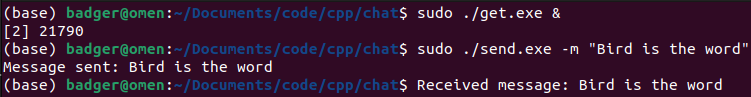

<p align="center">
	
</p>

<h1 align="center">Packet Pigeon</h1>

<p align="center">
	<strong>Send & recieve messages!</strong>
</p>

## 🚀 Overview

**Packet Pigeon** is a simple networking application that allows users to send and recieve messages.

## 🎨 Features

- **Specific Ports:** Users can send messages to specific ports.

## 🛠️ Installation

1. **Clone the repository**
```sh
git clone https://github.com/321BadgerCode/packet_pigeon.git
cd ./packet_pigeon/
```

2. **Install the dependencies**
```sh
sudo apt-get install libpcap-dev
```

3. **Build the project**
```sh
g++ ./send.cpp -o ./send.exe -lpcap
g++ ./get.cpp -o ./get.exe -lpcap
```

## 📈 Usage

1. **Run the `get.exe` executable in the background**
```sh
sudo ./get.exe &
```

2. **Send a message**
```sh
sudo ./send.exe -m <message>
```

<details>

<summary>💻 Command Line Arguments</summary>

### Get.exe
|	Argument		|	Description	|	Default		|
|	:---:			|	:---:		|	:---:		|
|	`-h & --help`		|	Help menu	|			|
|	`--version`		|	Version number	|			|
|	`-p`			|	Port number	|	`12345`		|

### Send.exe
|	Argument		|	Description	|	Default		|
|	:---:			|	:---:		|	:---:		|
|	`-h & --help`		|	Help menu	|			|
|	`--version`		|	Version number	|			|
|	`-i`			|	IP address	|	`127.0.0.1`	|
|	`-p`			|	Port number	|	`12345`		|
|	`-m`			|	Message		|	`Hello world!`	|

</details>

## 📸 Screenshots

<p align="center">
	
</p>

## 📜 License

This project is licensed under the MIT License - see the [LICENSE](./LICENSE) file for details.